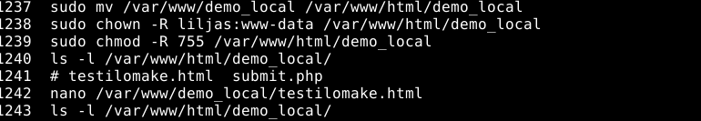
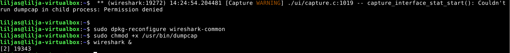

# h6-Salataampa

## Sisältö
- [x) Artikkeli](#x-artikkeli)
- [a) Let's](#a-lets)
- [b) A-rating](#b-a-rating)
- [c) Vapaaehtoinen](#c-vapaaehtoinen)

### Koneen tekniset tiedot
Prosessori: Intel Core i5-8265U CPU @ 1.60 GHz (1.80 GHz turbo, 8 ydintä)

RAM: 16 GB (15,7 GB käytettävissä)

Järjestelmä: Windows 11 Pro 64-bittinen (x64-suoritin)

Näytönohjain: Intel UHD Graphics 620

Tallennustila: 237 GB, josta 158 GB vapaana

DirectX-versio: DirectX 12

# x) Artikkeli 

### Let's- Encrypt - How it works

* Tässä artikkelissa kerrotaan että Let's Encrypt ja ACME-protokolla mahdollistavat HTTP serverin käyttöönoton siten, että  selainluotetun sertifikaatin saa käyttöön ilman välikäsiä.

* Prosessissa on kaksi askelta: ensin ACME-client todentaa Certificate Authoritylle (CA) että web-serveri kontrolloi domainia ja jonka jälkeen asiakas voi pyytää tai hylätä serifikaatin kyseiselle domainille.

### The Apache Software Foundation 2025: Apache HTTP Server Version 2.4 [Official] Documentation: SSL/TLS Strong Encryption: How-To: Basic Configuration Example

* SSL konfiguraation pitää sisältää vähintään:
  - **SSLCertificateFile** - sertifikaattitiedosto
  - **SSLCertificateKeyFile** - yksityinen avain
  - **HTTPS portti (443 oletus)**
  - **Salattuun liikenteeseen ohjaus (SSL Engine)**

* Tässä raportissa neuvotaan perusasetusten käyttöönotossa ja ohjeistetaan lukeaan loput SSL dokumentaatiosta ennen etenemistä haastavempiin vaiheisiin.

# a) Let's

Lähdin aloittamaan raporttia 26.09.2025 kello 21:11. 

Kirjauduin ensin virtuaalikoneelle ja avasin valmiiksi Let's Encryptin verkkosivut. Minulta löytyy virtuaalipalvelin ja domain `Liljasharifi.com` jonne aion asentaa salauksen.

Otin tunnilta muistiinpanoja ja hyödyllinen ohje löytyi myös DigitalOceanilta (2024), sekä certbotin instructions sivustolta.

### Aloitus

* Asensin certbotin
  - **`sudo apt update`** - päivittelin paketit
  
  - **`sudo apt install certbot python3-certbot-apache`** - asennettiin certbot
 

_Onnistunut certbotin asennus_
 
* **´sudo certbot --apache --domains liljasharifi.com,www.liljasharifi.com`** - komento jolla sertifikaatti ladataan

### Virhetilanne 

"Hint: The Certificate Authority failed to verify the temporary Apache configuration changes made by Certbot. Ensure that the listed domains point to this Apache server and that it is accessible from the internet."

 _sertifikaatin hankinta epäonnistuu_

* **`curl -l liljasharifi.com`** komennolla vinkkejä virhetilanteeseen

_vinkki virhetilanteesta_

Virheilmoitus:
"curl: (7) Failed to connect to liljasharifi.com port 80 after 21003 ms: Could not connect to server"

Tästä heräsi kysymys oliko portin asetukset kunnossa. Lähdin tarkistamaan seuraavasti, tästä oli tunnilta muistiinpanoja jossa virhetilannetta selviteltiin.

### Palomuurin tarkistusta

* **`sudo ufw status`**

* **`sudo ufw allow 80/tcp`**
  
* **`sudo ufw reload`**

Olihan se kunnossa. Lähdin hieman tutkimaan verkkoa ja tässä vierähtikin jo tovi. 

* **`ping liljasharifi.com`**
  - Ei vastausta. 

### Ratkaisu 

Ja sitten heureka -hetki. Tajusin että olen tehnyt nämä edellä mainitut komennot **paikalliskoneella.** Ehkä olisi järkevämpi tehdä raporttia muulloin kuin myöhään yöllä.

Toisaalta tuntui hyvältä, kun hoksasin itse asian. Lueskelin muutamia sivustoja läpi mutta heräsi ajatus, että jokin oleellinen menee tässä väärin.

Lähdin tekemään alusta:

### Muodostetaan SSH- yhteys palvelimelle:

* **`ssh lilja-web-01-fin@178.62.231.96`**

### Asennetaan uudelleen certbot mutta oikeaan paikkaan: 
* **`sudo apt update`** 
* **`sudo apt install certbot python3-certbot-apache`** 

### Kohtalon hetki eli ajetaan certbot ja kysytään sertifikaattia
* **`sudo certbot --apache --domains liljasharifi.com,www.liljasharifi.com`** 

_Onnistunut lopputulos_

Yksinkertainen asia jäi huomaamatta. Onneksi virhetilanteeseen löytyi yksinkertainen ratkaisu.

Kello oli tässä kohtaa 23:02 ja siirryin seuraavaan vaiheeseen.

# b) A-Rating 

* Avasin ohjeistuksen mukaisesti sivuston: `https://www.ssllabs.com/ssltest/`

* Syötin hakukenttään domainin eli liljasharifi.com

_A tulos eli onnistunut_

_Miellyttävästi lukko ilmestynyt sivulle_

# c) Vapaaehtoinen

Tähän osioon siirryin seuraavana päivänä 27.09.2025 kello 11.58.

Yritin katsoa opiskelijoiden http -linkkejä, mutta en saanut niitä auki. Siirryin verkkoon etsimään tietoa.

Pohdin miten tämän toteuttaisin weppilomakkeen tehtävänannon. Totesin, että olisi paras luoda nyt uusi testisivusto tätä varten, sillä haluan siistiä domainin sisältöä ja siirtyä sen osalta pikkuhiljaa ammattimaisempaan versioon aiemmmista testiversioista.

Löysin hyvän ohjeen lomakkeen (form) HTML-koodin luomiseen Apachen, sekä W3 schoolsin youtubesta ja verkkosivuilta.

## Uuden testisivun ja lomakkeen luominen

Päätin luoda paikallisesti virtuaalikoneen sisälle weppisivun localhostina, kuten ensimmäisissä tehtävänannoissa HTTP-yhteyttä käyttäen:

* Käynnistin virtuaalikoneen

* **`sudo apt update`** - päivitetään paketit

## Ulkomuistista:

### Luodaan hakemisto lomakkeelle ja annoin oikeudet

  - **`sudo mkdir -p /var/www/demo_local`**
    
  - **`sudo chown -R liljas:www-data /var/www/demo_local`**
    
  - **`sudo chmod -R 755 /var/www/demo_local`**
 
### Sitten HTML-lomake sisältöineen (Ohje katsottu W3 schoolsin sivuilta ja Apachen)

  - **`nano /var/www/html/demo_local/testilomake.html`**
    
  - `Ctrl + O, Enter ja Ctrl X`
 
 ### PHP-lomakkeen käsittelijän lisääminen
  - **`nano /var/www/html/demo_local/submit.php`**
    
  - Lisäsin sisällön jolla lukee lomaketietoja

### Potkaistaan demonia ja varmistetaan että Syntax OK (konfiguraation tarkistus configtestillä)
  - **`sudo systemctl reload apache2`**
    
  - **`sudo apache2ctl configtest`**

Ja viimeisenä jännitetään eli virtuaalikoneen internet-selaimella sivustolle:
* http://localhost/demo_local/testilomake.html

Aluksi ilmeni virhe, kun avasin ensin internet-selaimen isäntä koneesta. Kunnes totesin - että kyseessä on vain paikallinen weppisivu joten ainoa tapa päästä sisään oli virtuaalikoneen sisältä.

_Yllä mainittu prosessi kuvana_ 

## Sieppaa liikennettä

Tässä osiossa seurasin Ansonin (2024) ohjetta, ja askUbuntu (2006) keskustelufoorumia, sillä Wiresharkin käyttö on uutta.

Havaitsin onneksi hyvissä ajoin että Youtube-videon asennusprosessi eteni eri tavalla ja pikaisen googlettelun jälkeen löytyi oikeat komennot asennukseen.

### Wireshark Asennus

* **`sudo apt update && sudo apt upgrade -y`** - pakettien päivitys alkuun

* **`sudo apt install wireshark -y`** - asennetaan itse Wireshark

* **"Yes"** kohtaan "Non-superusers can capture packets?"

* **`sudo usermod -aG wireshark $liljas`** - Lisätään käyttäjä Wireshark ryhmään

* Kirjauduin välissä ulos

_Yes tähän kohtaan kuten yllä neuvottu_

### Virhetilanne

***liljas@lilja-virtualbox:~$  ** (wireshark:19272) 14:24:54.204481 [Capture WARNING] ./ui/capture.c:1019 -- capture_interface_stat_start(): Couldn't run dumpcap in child process: Permission denied***

Tähän löytyi ratkaisu AskUbuntu-sivuilta:

* **`sudo dpkg-reconfigure wireshark-common`**
  
* **`sudo chmod +x /usr/bin/dumpcap`** - Pakettien kaappauksen salliminen

Tässä oli ymmärtääkseni syynä (vinkki komennon alusta chmod)  eli oikeudet puuttuivat Wiresharkilta kaappaamiseen (capturing).

_Virhetilanne ja korjaus kuvassa_

### Käyttö

Tässä kohtaa yhdistin useita löytämiäni Youtube-videoita, jossa oli helpompi hahmottaa Wiresharkin toimintaa. Erityisesti apuna oli "How to use Wireshark to capture local host traffic" ja "Mastering Wireshark: The Complete Tutorial!" videot. 

* **`wireshark &`** - käynnistin wiresharkin
  - Tehty vain paikallisesti joten valitsin Loopback(lo)

* **`ping -c 10 127.0.0.1.`** - syötetty terminaaliin: vain kymmenen pakettia, jotta ei tarvinnut keskeyttää

_Lokitiedot alkoivat muodostumaan_ 

### Pakettien analysointi

Kuva 1

Kuva 2

Kuva 3

### Mitä havaitsen? 

Tässä muutamia havaintoja yllä olevista kuvista:

**Kuvassa 1**

* Protokolla: **ICMP(Internet Control Message Protocol)** - testataan verkkoyhteyttä tällä 

2. Paketti 21: Käyttää protokollaa  **MDNS eli (Multicast DNS)- kysely** osoitteeseen 224.0.0.251.

**Kuvassa 2**

* Täytin lomakkeen käyttäjätunnuksella: esimerkki ja salasana: salasana

* Riville 36 ilmestyi protokolla "HTTP"

**Kuvassa 3**

* Rivillä 36 näen kuitenkin kriittisen kohdan: **Käyttäjätunnus ja salasana näkyy**

* Tällä on äärettömän suuri vaikutus tietoturvaan, koska sitä ei ole. Kaikki syötetty tieto on jokaisen näkyvissä.

### Lopputulemaa

Pidin raportin teossa hieman välipäiviä, joten tätä kirjoittaessa on 29.09.2025 kello 20:07.

Tämän raportin tekeminen ja tehtävänanto oli kaikinpuolin mieluisaa. Vaikka joitakin kohtia piti käydä katsomassa ohjeista, tuntuu että ymmärsi nopeasti itsekin, missä teki virheen jos sellainen kävi.

Opittavaa jäi tämänkin jälkeen varmasti eikä ihan kaikki ulkomuistista tule - vaikka on tullut paljon opittuakin.

# Lähteet

Anson A. 2024. Youtube. Video. _Wireshark Tutorial for Beginners | Network Scanning Made Easy_ Katsottavissa: https://www.youtube.com/watch?v=qTaOZrDnMzQ Katsottu: 26.09.2025.

Apache. Verkkosivu. _SSL/TLS Strong Encryption: How-To_ Luettavissa: https://httpd.apache.org/docs/2.4/ssl/ssl_howto.html#configexample Luettu: 29.09.2025.

AskUbuntu. Keskustelufoorumi. _Setting up wireshark for non root user_ Luettavissa: https://askubuntu.com/questions/246363/setting-up-wireshark-for-non-root-user Luettu: 26.09.2025.

Computer General Purpose. 2020. Youtube. Video. _How to use Wireshark to capture local host traffic (127.0.0.1)_ Katsottavissa: https://www.youtube.com/watch?v=V0_RPT6HsE4 Katsottu: 26.09.2025.

Hacker Joe. 2024. Youtube. Video.  _Mastering Wireshark: The Complete Tutorial!_ Katsottavissa: https://www.youtube.com/watch?v=a_4MjV_-7Sw&t=500s Katsottu: 26.09.2025.

Heidi, E. DigitalOcean. 2016. Verkkosivu. _How to Set Up Let’s Encrypt Certificates for Multiple Apache Virtual Hosts on Ubuntu 14.04_ Luettavissa: https://www.digitalocean.com/community/tutorials/how-to-set-up-let-s-encrypt-certificates-for-multiple-apache-virtual-hosts-on-ubuntu-14-04/ Luettu: 26.09.2025.

Horcasitas, J & Heidi, E. &  & Walia, A. 2024. Digitalocean. Verkkosivu. _How To Secure Apache with Let's Encrypt on Ubuntu_  Luettavissa: https://www.digitalocean.com/community/tutorials/how-to-secure-apache-with-let-s-encrypt-on-ubuntu/ Luettu: 26.09.2025.

Karvinen, T. 2017. Verkkosivu. _First Steps on a New Virtual Private Server – an Example on DigitalOcean and Ubuntu 16.04 LTS_ Luettavissa: https://terokarvinen.com/2017/first-steps-on-a-new-virtual-private-server-an-example-on-digitalocean/ Luettu: 13.09.2025.

Karvinen, T. 2025. Verkkosivu. _Linux Palvelimet 2025_ Luettavissa: https://terokarvinen.com/linux-palvelimet/ Luettu: 13.09.2025.

Let's Encrypt. 2018. Keskustelufoorumi. _Multiple virtual hosts, multiple domains in host one cert for each host_ Luettavissa: https://community.letsencrypt.org/t/multiple-virtual-hosts-multiple-domains-in-host-one-cert-for-each-host/ Luettu: 26.09.2025.

Let's Encrypt. 2025. Verkkosivu. _Getting Started_ Luettavissa: https://letsencrypt.org/how-it-works/ Luettu: 29.09.2025.

Red Hat Enterprise Linux. 2025. Youtube. Video. _Wireshark Terminal Version: Analyzing Network Traffic in Real-Time_ Katsottavissa: https://www.youtube.com/watch?v=aOILSNnbh58 Katsottu: 26.09.2025.

101LABS. Verkkosivu. _Lab 50 – Capturing credentials submitted through http with Wireshark_ Luettu: https://www.101labs.net/comptia-security/lab-50-capturing-credentials-submitted-through-http-with-wireshark/ Luettavissa: 26.09.2025.

W3 schools. 2024. Youtube. Video. _HTML Tutorial_ Katsottavissa: http://youtube.com/watch?v=VLeERv_dR6Q&list=PLP9IO4UYNF0VdAajP_5pYG-jG2JRrG72s Katsottu: 26.09.2025.

W3 schools. Verkkosivu. _PHP Form Handling_ Luettavissa: https://www.w3schools.com/php/php_forms.asp Luettu: 26.09.2025.

